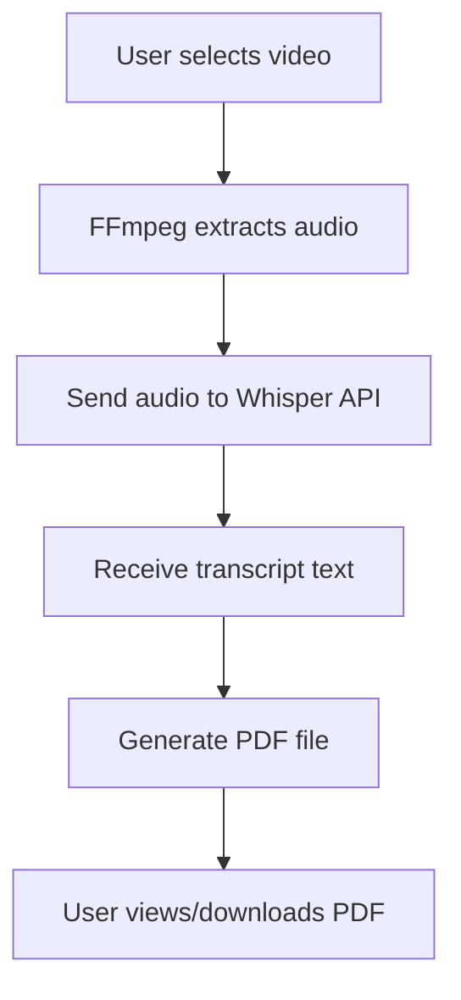

# 📄 PDFy App

PDFy is a Flutter-based web application that converts video content into structured transcripts.  
It extracts audio from a selected video using **FFmpeg**, transcribes it with **OpenAI Whisper API**, and generates a **PDF file** containing the transcript.  
The app provides a simple, clean, and efficient workflow for converting video meetings or lectures into shareable documents.

---

## ✨ Features
- 🎥 **Video Selection** – Upload or pick a video file directly.  
- 🎧 **Audio Extraction** – Uses FFmpeg to separate audio from the video.  
- 📝 **Accurate Transcription** – Powered by OpenAI Whisper API for speech-to-text conversion.  
- 📄 **PDF Generation** – Automatically formats and saves the transcript as a PDF.  
- 📂 **View & Share** – Open, view, and share generated transcripts easily.  

---

## 🛠️ Technical Stack
- **Frontend**: Flutter (Web & Mobile)  
- **Speech-to-Text**: OpenAI Whisper API  
- **Media Processing**: FFmpeg  
- **Database / Storage**: Firebase (for user files and PDFs)  

---

## 🏗️ Architecture

📸 Screenshots  

  
  &nbsp;&nbsp;&nbsp;&nbsp; <!-- adds spacing -->
  

